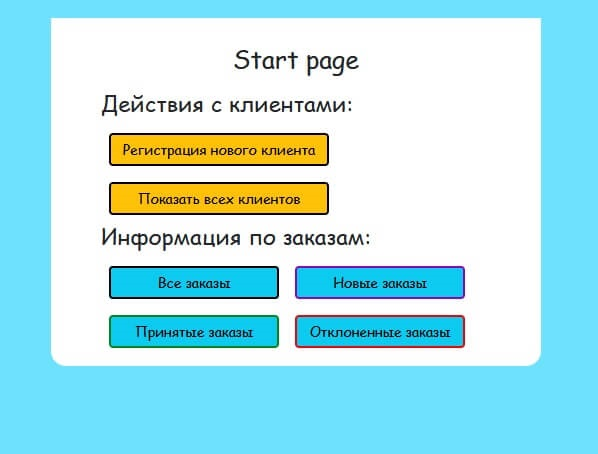
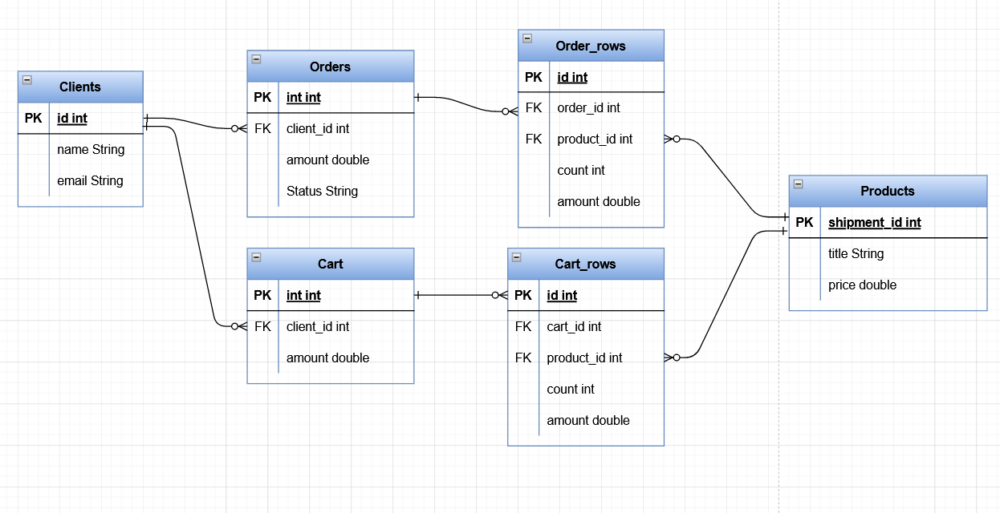

# Spring Boot. Educational project

Цель: изучение Spring Boot

### Технологии
- Spring Boot
- Spring MVC
- Spring Data JPA
- Hibernate
- MySql
- Lombok
- Thymeleaf
- HTML
- CSS
- Bootstrap

### Краткое описание
В проекте реализовано web-приложение (интернет-магазин) на основе фреймворка Spring Boot. 
Для управления данными использована СУБД MySQL.

### В приложении возможно
:white_check_mark: Зарегистрировать нового клиента.<br>
:white_check_mark: Каждому клиенту выбрать доступные товары для заказа и добавить их в корзину, изменить состав корзины и оформить заказ.<br>
:white_check_mark: Посмотреть информацию о клиентах (всех зарегистрированных клиентов, корзины клиентов, заказы клиентов). <br>
:white_check_mark: Посмотреть информацию о заказах (все заказы, только новые, завершенные, принятые заказы или заказы в процессе) и изменить статус заказа. 

### Стартовая страница


### Страница регистрации


### Модель базы данных


### Пример кода
```
package ru.lazarenko.springboot;

import org.springframework.boot.SpringApplication;
import org.springframework.boot.autoconfigure.SpringBootApplication;

@SpringBootApplication
public class Application {

    public static void main(String[] args) {
        SpringApplication.run(Application.class, args);
    }

}
```